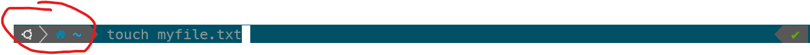

> This the WORKING COPY version, for instructors to update as they wish.

> **DO NOT SHARE WITH STUDENTS**

> That is, until instructor-only files like 'THINGS_I_REMOVED.md' are removed (ironic)

# Installfest

## Topics Covered / Goals

- Get your local machine set up to start the course
- Exploring your IDE (VSCode)

## Conventions

Throughout this installfest document we will be asking you to type commands into a terminal shell, which will differ based on your operating system. No matter which operating system/terminal shell you are using, we will represent inputting a command into this environment like so:

```bash
$ touch myfile.txt
```

The `$` is there to represent everything that comes before the section where you actually input the command, which on my local environment looks like:



If we don't include the `$` that means it's just an ordinary code snippet to be pasted into VSCode, for example:

```js
console.log("hello");
```

Alternatively, if you are in a unique environment that isn't just your ordinary terminal shell we will specify it explicitly like so:

```bash
postgres=#
```

Additionally, sometimes we will want to explain what the command does in the snippet we share. We can do this using comment syntax, which you are familiar with from the JavaScript pre-work, but in a terminal environment comments begin with a `#`. So for example, we might share a command like so:

```bash
# this command will create a new blank file in the current directory and name it 'myfile.txt'
$ touch myfile.txt
```

Sometimes you will also need to replace a value in the command we provide with one unique to you. In that case we will use syntax like `<YOUR_FILE>` to indicate such a value. So for example, the command:

```bash
$ git config --global user.name "<YOUR_NAME>"
```

should result in something like

```bash
$ git config --global user.name "Benjamin Cohen"
```

## Computer Setup (Mac/Linux/Windows)

Before we get started, just know that this can be chaotic, everyone's environment is slightly different and those little differences are usually the source of bugs that appear on one machine but not on another (seemingly identical) one. Your goal is to get a working environment, or as close to that as you can, so follow the instructions closely, check after every major step that what you tried to install is in fact now available and working, and do not hesitate to reach out to an instructor or TA when something isn't working as expected.

- [Slack](https://slack.com/downloads) - for all communication purposes
- [Zoom](https://zoom.us/support/download) - for participating in the class in real time

### MacOS

- [Mac](./MacOS/README.md)

### Windows

- [Windows](./Windows/README.md)

### Linux

- [Linux](./Linux/README.md)
